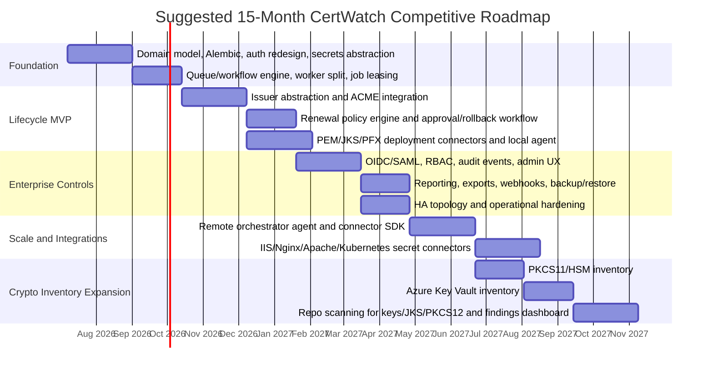
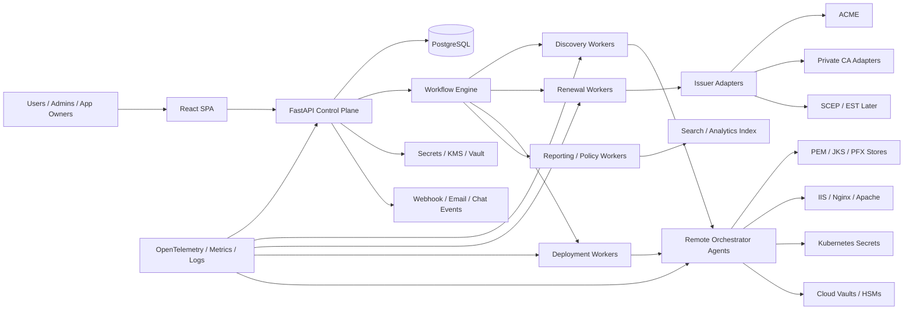

# CertWatch Gap Analysis and Development Plan Against Keyfactor Command and Cryptographic Discovery and Inventory

## Executive summary

CertWatch is already a credible certificate visibility MVP for authorized internal networks. Based on the repository, it can scan hostnames, IPs, CIDR blocks, and IP ranges over configurable ports, capture untrusted TLS certificates with a native Python scanner, deduplicate certificates by SHA-256 fingerprint, preserve endpoint observation history, and send alerts through SMTP, Microsoft Teams, or generic webhooks. It ships as a simple single-service FastAPI + React application with SQLite for development and PostgreSQL for production. That is a strong base for an internal inventory product, especially because the current implementation is operationally simple and focused. citeturn3view0turn6view0turn6view1turn13view0turn13view1

Keyfactor Command and Keyfactor’s Cryptographic Discovery & Inventory offering are much broader. Public and official documentation shows three major capability layers beyond CertWatch’s current scope: lifecycle automation across issuers and certificate stores, enterprise governance and operational controls, and broad cryptographic discovery across cloud, endpoints, repositories, HSMs, protocols, and code. Command emphasizes end-to-end lifecycle governance, zero-touch automation, modular orchestrators, reporting, alerts, RBAC, and API-driven operations. AgileSec adds continuous cryptographic asset discovery, risk analytics, policy/compliance reporting, multi-tenant architecture, high availability, and specialized sensors such as Azure Key Vault, PKCS#11, GitLab/GitHub, and Qualys. citeturn29view0turn29view1turn23view3turn33view3turn36view2turn36view3turn36view4turn36view5

The most important conclusion is that a direct, full-platform feature match with “Command + AgileSec” is not a realistic 12–18 month target for a small team unless the scope is narrowed. The pragmatic competitive path is to focus first on becoming a **self-hosted certificate lifecycle automation platform for internal/private TLS**, with strong discovery, automated renewal, store deployment, RBAC/SSO, auditability, HA, and a small set of high-value connectors. That would let CertWatch compete more directly with the **core Command use case**. After that, the second wave should add selected **AgileSec-like crypto inventory** features where they most closely align with your user base: HSM/PKCS#11 inventory, cloud key-vault discovery, and repo scanning for keys/keystores. citeturn29view0turn29view1turn33view0turn33view3

In practical terms, the minimum viable set of features required to compete with Command in a mid-market enterprise buying cycle is: durable renewal workflows, issuer abstraction with at least ACME and one internal CA path, deployable agents or connectors for common stores, RBAC + SSO, immutable audit logging, reporting, secrets/HSM integration, and a horizontally scalable worker model. Without those, CertWatch remains a visibility tool rather than a certificate lifecycle management platform. citeturn18search4turn32view0turn32view1turn30view2turn20search2turn33view0

## Current-state inventory of CertWatch

The table below uses the CertWatch GitHub repository as the primary source. Where the repository does not clearly define a capability, it is marked **unspecified**.

| Area | Current CertWatch state | Evidence |
|---|---|---|
| Product scope | Internal SSL/TLS certificate inventory and expiration alerting for authorized internal networks. No automated renewal in the current iteration. | README describes “SSL/TLS certificate inventory and expiration alerting” and endpoint scans; no repository evidence of issuance or renewal workflows. citeturn3view0turn13view1 |
| Discovery inputs | Hostname/FQDN, single IP, CIDR block, IP range, configurable ports, scan frequency, timeout, concurrency, environment, owner, tags, SNI toggle, and per-target alert thresholds. | citeturn3view0turn6view2 |
| Discovery method | Native Python `ssl`/`socket` TLS handshake with certificate verification disabled for observation only; no shelling out; full chain capture on Python 3.13+ using `get_unverified_chain`. | citeturn3view0turn13view0turn5view1 |
| Inventory normalization | Certificates deduplicated by SHA-256 fingerprint; endpoints unique by `(host, ip, port)`; immutable `CertificateObservation` history for each scan; failed scans preserved as first-class observations. | citeturn3view0turn6view2 |
| Data model | Core entities: `Target`, `ScanJob`, `Endpoint`, `Certificate`, `CertificateObservation`, `AlertEvent`, `NotificationChannel`, `SystemSetting`, `AuditLog`. No separate issuer, key, store, workflow, or tenant model yet. | citeturn6view2 |
| Architecture | Single deployable service. React + TypeScript SPA served by FastAPI in production; REST API under `/api`; scanning, scheduler, alert evaluation, notifications, and API all collocated. | citeturn3view0turn6view3 |
| Backend stack | Python 3.11+ supported, Python 3.13 recommended; FastAPI, Uvicorn, SQLAlchemy, Pydantic, APScheduler, cryptography, psycopg2, pytest. | citeturn3view0turn6view0turn5view1 |
| Frontend stack | React 18, React Router, TypeScript, Vite. | citeturn6view1turn8view0 |
| Database | SQLite for local development; PostgreSQL for production and Docker Compose deployment. | citeturn3view0turn5view2turn15view1 |
| Deployment model | Docker multi-stage build; Compose with app + PostgreSQL; FastAPI serves built SPA; local backend/frontend development documented. Kubernetes deployment is **unspecified** in the repo. | citeturn5view1turn5view2turn3view0 |
| Scheduler | In-process APScheduler tick running inside the API process. Repo explicitly notes this limits horizontal scaling and recommends a single API instance unless scheduling is externalized. | citeturn3view0turn15view3 |
| Scan execution | Background thread per scan job, with a bounded `ThreadPoolExecutor`; per-target concurrency capped to 500; DNS resolution done in worker; failures never crash the worker. | citeturn13view1 |
| Integrations | SMTP, Microsoft Teams webhook, generic webhook. CA connectors, cloud inventory connectors, LDAP/AD connectors, HSM integrations, ITSM/CMDB connectors, and repo scanners are **unspecified** or absent in the reviewed repo. | citeturn3view0turn11view0 |
| REST API | CRUD for targets, scan control, certificate and endpoint inventory, alerts, channels, settings, dashboard, Swagger UI at `/docs`. | citeturn3view0 |
| UI/UX | Main navigation includes Dashboard, Targets, Certificates, Endpoints, Scan Jobs, Alerts, and Settings; dark mode; help panel; sortable/searchable/paginated tables; certificate and endpoint detail pages. | citeturn10view0turn10view2turn9view0turn12view0turn12view1turn12view2 |
| Current certificate analytics | Expiring, expired, self-signed, internal/external heuristic, recently changed, failed scan counts, per-cert endpoint counts, basic severity states. | citeturn12view0turn12view1turn14view1turn15view4 |
| “Internal issued” logic | Heuristic only: self-signed certificates are considered internal; otherwise issuer DN substring matching uses configured `CERTWATCH_INTERNAL_CA_PATTERNS`. | citeturn14view1turn15view0 |
| Security controls | Strict hostname/IP validation, no shelling out, optional static bearer token, secret scrubbing in API responses, CORS configuration, server-side storage of SMTP/webhook secrets, authorization notice for scanning. | citeturn3view0turn13view2turn14view2turn15view0 |
| Access control | Optional shared bearer token only. Multi-user auth, RBAC, and SSO are explicitly called future enhancements. | citeturn3view0turn15view0 |
| Audit logging | Audit log model exists; README states target and channel changes are written to audit log. Broader audit coverage is **unspecified** in the reviewed repo. | citeturn3view0turn6view2 |
| Scalability | Limited by collocated API/scheduler/worker design and in-process scheduler. Horizontal worker fleet, queue-based execution, and HA coordination are not implemented. | citeturn3view0turn13view1turn15view3 |
| Backup/restore | Backup/restore procedures are **unspecified** in the repo. | Repository reviewed: no explicit backup/restore guidance beyond PostgreSQL persistence volume in Docker Compose. citeturn5view2turn3view0 |
| Telemetry and observability | Standard Python logging, persistent scan job state, alert records, and audit logs. Formal metrics, tracing, log shipping, and SLO instrumentation are **unspecified**. No Prometheus/OpenTelemetry packages appear in requirements. | citeturn6view0turn6view2turn6view3 |
| Testing and release maturity | README documents 27 backend tests and frontend production build checks. Repository page shows 4 commits and no published releases. | citeturn3view0turn3view0 |

A concise way to frame the product today is this: **CertWatch is a good network-facing TLS observation and alerting system, but it is not yet a certificate lifecycle automation or enterprise cryptographic inventory platform.** That distinction is what drives almost every gap in the rest of this report. citeturn3view0turn13view1turn29view0turn29view1

## Feature-by-feature comparison against Keyfactor

The comparison below uses public and official documentation for Keyfactor Command and Keyfactor AgileSec. Where a capability is delivered by an adjacent official Keyfactor component rather than the Command core itself, that is called out explicitly.

| Capability | CertWatch | Keyfactor Command / Cryptographic Discovery & Inventory | Competitive reading |
|---|---|---|---|
| Discovery methods | Network TLS discovery from user-defined hostname/IP/CIDR/range targets over ports. No CA sync, store discovery, repo scan, or cloud sensor capability in reviewed repo. citeturn3view0turn13view1 | Command: continuous discovery/inventory across public and private CAs, cloud services, network endpoints, Kubernetes, and key/certificate stores; modular orchestrators discover/manipulate stores. AgileSec: sensors for code, servers, endpoints, cloud workloads, network traffic, EDR/vulnerability tools, repositories, and HSMs. citeturn29view0turn23view3turn29view1turn36view1 | This is the single largest functional gap. CertWatch sees network-presented certificates; Keyfactor sees far more of the cryptographic estate. |
| Protocol support: ACME | No ACME server/client support evidenced. citeturn3view0 | Supported through **Keyfactor ACME**, which acts between ACME clients and Keyfactor Command for requests, renewals, and revocations. citeturn18search4turn18search0turn18search7 | Direct competitive requirement if you want modern automated issuance. |
| Protocol support: SCEP | No SCEP support evidenced. citeturn3view0 | Supported through official **Keyfactor SCEP** implementation. citeturn18search1turn28search0 | Important for device/network PKI, less urgent for app/server TLS-first wedge. |
| Protocol support: EST | No EST support evidenced. citeturn3view0 | Supported through **EJBCA EST / Enrollment Proxy** integrated with Keyfactor Command for EST requests to supported CAs. citeturn18search2turn28search1 | Relevant for modern device and IoT enrollment. |
| Protocol support: PKCS#11 | No PKCS#11 support evidenced. citeturn3view0 | AgileSec has an official **PKCS#11 sensor** that discovers certificates and keys across HSMs; Keyfactor also documents HSM-backed application-level encryption paths in parts of its platform. citeturn36view4turn22search9 | Important for enterprise crypto inventory and HSM-heavy customers. |
| Protocol support: JKS | No JKS discovery or management evidenced. citeturn3view0 | Command supports Java keystore discovery/management through Java Agent, Universal Orchestrator, remote file extension, and certificate store types; AgileSec Git repository sensors also detect JKS/JCEKS/PKCS12 keystores. citeturn23view1turn23view3turn23view0turn36view5 | JKS handling is a practical must-have for Java-heavy environments. |
| Protocol support: PFX / PKCS#12 | No PFX parsing, issuance, or deployment evidenced. citeturn3view0 | Command supports PFX enrollment, PKCS#12 store types, and certificate recovery/download in PFX/P12 formats. citeturn19search2turn19search7turn19search20 | Basic Windows and app-server interoperability gap. |
| Issuance | Not implemented. Repository only supports discovery and alerting. citeturn3view0 | Command supports certificate enrollment and issuance via Management Portal and API. citeturn30view0turn31search5 | Core CLM gap. |
| Renewal | Not implemented. Alerts can identify upcoming expiry but no automated renewal workflow exists. citeturn3view0 | Command supports renewal workflows and API-based renewal; product page emphasizes zero-touch automation and faster renewals. citeturn29view0turn32view0 | The most commercially important gap. |
| Revocation | Not implemented in reviewed repo. citeturn3view0 | Command exposes revocation workflows and API endpoints, including revocation reasons and scheduling. citeturn32view1turn31search17 | Necessary for full lifecycle credibility. |
| Policy enforcement | Limited to target validation, CIDR guardrails, alert thresholds, optional self-signed alerts, and internal-issuer heuristics. No issuance policy engine. citeturn3view0turn15view0 | Command supports template and enrollment-pattern policy settings, regex validation, role-linked enrollment policy, one-click renewal controls, and workflow enforcement; AgileSec adds customizable risk policies and posture reporting. citeturn32view2turn32view3turn29view1 | CertWatch currently has operational rules, not enterprise policy governance. |
| Role-based access control | Not implemented; README explicitly says RBAC is future work. citeturn3view0 | Command supports security roles and claims; AgileSec documents RBAC, permissions, SSO, and token-based access. citeturn30view2turn22search21turn34search0turn34search1 | Enterprise blocker for multi-team adoption. |
| Audit / logging | Audit log exists, but reviewed repo only clearly documents target/channel changes plus normal app logging. citeturn3view0turn6view2 | Command has full audit log UI/API, default seven-year retention, tamper validation, server log output, and centralized logging options. citeturn20search2turn20search5turn20search17turn30view3 | Major governance and compliance gap. |
| Alerting | SMTP + Teams/generic webhook; expiring, expired, changed, scan failure, optional self-signed; mute/ack/re-alert support. citeturn3view0turn14view0 | Command supports expiration alerts, reporting alerts, email/chat-oriented notifications, and renewal handlers; AgileSec continuously alerts on insecure crypto findings. citeturn35search7turn35search15turn29view0turn29view1 | CertWatch alerting is decent for an MVP, but lifecycle and risk alert breadth is much narrower. |
| Reporting | Basic dashboard and list/detail views only. Built-in exports and formal report engine are not evidenced. citeturn12view0turn12view1 | Command supports built-in and custom reports, scheduling, exports, and report manager; AgileSec adds dashboards and policy/compliance reports. citeturn29view0turn35search2turn22search18turn29view1 | Another enterprise buying-committee gap. |
| API / SDK | REST API documented via Swagger; supports inventory and operational actions. Official SDK is unspecified. citeturn3view0 | Command exposes a broad, secure REST API for enrollment and management; AgileSec documents scan APIs, callbacks, and API-based automation. Official SDK availability is not clearly evidenced in reviewed official sources. citeturn30view0turn30view1turn34search8turn34search2 | CertWatch API is solid for MVP, but narrower and less workflow-centric. |
| Connectors: AD / LDAP | Not evidenced. | Command relies heavily on AD/Kerberos/LDAP/DNS in common deployments and supports OAuth/OIDC identity providers; CA Connector documentation explicitly references Active Directory connectivity. citeturn16search1turn22search11turn22search15 | Needed for enterprise authz, ownership mapping, and service identity workflows. |
| Connectors: cloud providers | Not evidenced. | Command supports cloud-oriented certificate management via extensions; AgileSec has official sensors such as Azure Key Vault and others. citeturn23view3turn36view2turn25search8 | High-priority for modern infra estates. |
| Connectors: HSMs | Not evidenced. | AgileSec provides PKCS#11 and HSM-related sensors; broader Keyfactor platform documents HSM-backed encryption choices. citeturn36view4turn22search9 | Required if CertWatch wants to move toward crypto inventory and secure key ops. |
| Inventory normalization | Deduped certificates + endpoint bindings + scan observations. Strong for endpoint TLS inventory. citeturn6view2 | AgileSec documents centralized inventory with automatic correlation of cryptographic objects and a formal cryptographic data model. citeturn29view1turn36view0 | CertWatch’s current model is good for cert visibility, but not broad enough for crypto-normalization across systems. |
| Cryptographic inventory breadth | Certificates on scanned endpoints only. No first-class key, CA, algorithm, protocol, token, or library inventory. citeturn3view0turn6view2 | Command covers certificates, keys, SSH identities, CAs, and store inventory; AgileSec adds keys, certificates, algorithms, protocols, libraries, tokens, repositories, databases, cloud key stores, and HSMs. citeturn29view0turn22search3turn29view1turn36view2turn36view4turn36view5 | This is the biggest gap versus AgileSec specifically. |
| Vulnerability scanning | Limited to expiry, self-signed, unexpected certificate changes, and scan failures. No protocol/cipher/library/weak-key analysis evidenced. citeturn3view0turn14view0 | AgileSec identifies insecure key sizes, exposed keys, deprecated algorithms, policy violations, protocol/cipher findings, and quantum-vulnerable crypto; Qualys integration adds protocol/cipher visibility. citeturn29view1turn36view3 | Major risk-analytics gap. |
| Analytics / prioritization | Summary counts, severity states, expiring lists, internal/external heuristic. citeturn12view0turn14view1 | AgileSec prioritizes by exposure, severity, and business impact; key data model and dashboards support posture analysis. citeturn29view1turn33view3turn36view0 | You need a findings/risk model, not just an alert model. |
| Multi-tenant support | Not implemented; **unspecified** in repo. | AgileSec architecture guide explicitly describes v3 as multi-tenant. Command public docs reviewed do not clearly document true SaaS multi-tenancy semantics, but product deployment options include hosted and self-hosted modes. citeturn33view3turn29view0 | Multi-tenancy is optional for the first CertWatch competitive phase, but important for MSP/SaaS motion. |
| High availability | Not implemented; repo warns scheduler is in-process and horizontal scaling requires externalization. citeturn3view0turn15view3 | Command supports HA with shared SQL DB, same encryption certs/keys, job locking, and load balancing; AgileSec has an official on-prem HA guide. citeturn33view0turn33view1turn33view2 | Enterprise production-readiness gap. |
| Backup / restore | Unspecified. | Command documents backup, disaster recovery, SQL encryption key backup, and controlled DB migration; AgileSec documents DR and backup process guides. citeturn20search0turn20search3turn20search6turn35search1 | Procurement and security-review gap. |
| Compliance mapping | No compliance mapping evidenced. | Keyfactor claims easier audits, policy/compliance reports, complete logging, and posture measurement; explicit prebuilt framework-to-control mapping was not clearly evidenced in the reviewed public docs. citeturn29view0turn29view1turn20search2 | You can close much of this gap with reporting and control evidence before adding full regulatory templates. |

The implication is straightforward: **CertWatch is closest to the “find expiring certificates on internal networks” slice of Keyfactor, but it does not yet overlap sufficiently with the “orchestrate lifecycle” or “discover cryptography everywhere” slices.** citeturn3view0turn29view0turn29view1

## Gap analysis and prioritized roadmap

### Priority gap assessment

The table below ranks the most important gaps by customer impact, implementation complexity, security risk if left unresolved, and rough effort. The effort estimates are reasoned engineering estimates based on the current CertWatch architecture and the scope implied by the reviewed Keyfactor capabilities and relevant standards. The person-week values are directional, not contractual.

| Gap | Customer impact | Implementation complexity | Security risk if not addressed | Rough effort | Priority |
|---|---|---:|---:|---:|---|
| Automated renewal and issuance workflows | High | High | High | 20–28 person-weeks | Highest |
| Scalable background execution and external workers | High | Medium | Medium | 12–18 person-weeks | Highest |
| RBAC, SSO, user model, and stronger auth | High | Medium | High | 16–24 person-weeks | Highest |
| Certificate store deployment and discovery connectors | High | High | High | 24–36 person-weeks | Highest |
| CA / issuer abstraction with ACME first | High | Medium | High | 12–18 person-weeks | Highest |
| Immutable audit, reporting, and enterprise exports | High | Medium | Medium | 10–16 person-weeks | High |
| HA, migrations, backup/restore, disaster recovery | High | Medium | High | 10–14 person-weeks | High |
| Secrets management and KMS/HSM integration | Medium | Medium | High | 12–20 person-weeks | High |
| Policy engine for key size, issuer, ownership, renewal SLOs | High | Medium | High | 10–16 person-weeks | High |
| Modern API model with events/webhooks/idempotent workflows | Medium | Medium | Medium | 8–12 person-weeks | High |
| Cryptographic inventory beyond endpoint certs | High | High | Medium | 24–40 person-weeks | Medium |
| Vulnerability and protocol analytics | Medium | Medium | High | 12–18 person-weeks | Medium |
| Multi-tenancy | Medium | High | Medium | 14–22 person-weeks | Medium |
| Repo / cloud / HSM sensors | Medium | High | Medium | 18–30 person-weeks per sensor family | Medium |

### What is minimally necessary to compete

If the goal is to compete more directly with **Keyfactor Command** inside 12–18 months, the minimum viable competitive feature set should be:

1. **Discovery + normalized inventory** that is at least as good as today, but with stronger ownership, grouping, and policy context. citeturn3view0turn14view1  
2. **Automated renewal** for common server/application TLS certificates, starting with ACME and one private-CA path. The need is intensified by shrinking certificate lifetimes and by the fact that ACME is the dominant automation protocol for modern TLS issuance. citeturn18search4turn27search0  
3. **Store deployment connectors** for PEM, JKS, and PKCS#12/PFX, because certificate renewal without deployment still leaves outage risk in place. Relevant file and store formats are standardized or well-established, including ACME, EST, SCEP, PKCS#12, PKCS#11, and X.509. citeturn27search0turn28search0turn28search1turn27search2turn27search3turn27search4  
4. **Enterprise controls**: OIDC/SAML SSO, RBAC, auditability, reporting, backup/restore, and HA. These are table-stakes in direct Keyfactor evaluations. citeturn30view2turn20search2turn33view0turn33view2  

Aiming to match **AgileSec’s full cryptographic discovery breadth** in the same period would likely dilute execution. The better approach is to add **two or three high-value sensors** after the lifecycle core is solid: PKCS#11/HSM inventory, Azure Key Vault inventory, and repository scanning for keys/keystores. citeturn36view2turn36view4turn36view5

### Recommended roadmap

The roadmap below assumes two-week sprints and a focused product strategy: **first become a credible self-hosted certificate lifecycle automation platform, then selectively expand into cryptographic discovery.**

That roadmap translates into the following milestone plan:

| Window | Milestone | Outcome | Representative sprint-level tasks |
|---|---|---|---|
| Months 0–3 | **Foundation for CLM** | Break the single-node MVP ceiling. Replace in-process scheduler assumptions with durable workflow/job infrastructure. | Add Alembic migrations; separate API from worker responsibilities; introduce `User`, `Role`, `SecretRef`, `Issuer`, `Policy`, `DeploymentTarget`; implement JWT/OIDC auth gateway; add job states, retries, locks, and idempotency keys. |
| Months 3–6 | **Lifecycle MVP** | Turn CertWatch from “visibility” into “visibility + renewal.” | Implement issuer abstraction; ship ACME adapter; create renewal policies and windows; add certificate request/renew/revoke state machine; create deployment connectors for PEM, JKS, and PKCS#12; add post-renew verification scan. |
| Months 6–9 | **Enterprise control plane** | Make CertWatch pass security review in larger environments. | Add OIDC/SAML SSO; granular RBAC; tenant-ready ownership model even if single-tenant initially; immutable audit events; report/export engine; webhook events; admin activity pages; documented backup and restore. |
| Months 9–12 | **Operational scale + common connectors** | Close the most visible Command competitive gaps. | Build remote orchestrator/agent; ship connector SDK; add IIS, Nginx, Apache, Kubernetes secret/cert-manager adjacent integration; add canary/rollback deployment flow; implement HA reference architecture and runbooks. |
| Months 12–15 | **Selective crypto inventory expansion** | Start competing with the entry slice of AgileSec. | Add PKCS#11/HSM inventory; Azure Key Vault inventory; repo scanner for keys, JKS, PKCS#12, PEM; findings model for weak keys/algorithms; asset-to-instance correlation. |
| Months 15–18 | **Optional second-wave enterprise features** | Broaden addressable market after the core is stable. | Add multi-tenancy; CMDB/ServiceNow sync; compliance dashboards; protocol/cipher analytics; more sensors and cloud providers. |

### Resource estimate

A realistic team to execute this roadmap without stalling core quality would look like this:

| Phase | Engineers | SRE / Platform | Security | QA | Notes |
|---|---:|---:|---:|---:|---|
| Foundation | 3–4 | 0.5 | 0.5 | 1 | Heavy backend/platform work |
| Lifecycle MVP | 4–5 | 0.5 | 0.5 | 1 | One engineer should focus on connectors/agent |
| Enterprise controls | 4–5 | 1 | 0.5–1 | 1–1.5 | Security review workload increases |
| Scale and integrations | 5–6 | 1 | 0.5 | 1–1.5 | Agent SDK and connector QA require breadth |
| Crypto inventory expansion | 5–6 | 1 | 0.5 | 1.5 | Sensor diversity expands test matrix |

A sensible steady-state staffing model is **5 engineers, 1 SRE/platform engineer, 0.5–1 security engineer, and 1 QA engineer**, with UX/product design support strongly recommended even if not full time. Anything lighter risks shipping partial enterprise features that do not survive procurement scrutiny.

## Recommended architecture, API, data model, and UX

The architectural recommendation is to **preserve the current React + FastAPI + PostgreSQL strengths**, but stop treating CertWatch as a single deployable binary. The current MVP structure is excellent for speed, but direct competition with Command requires a control plane, durable workflows, deployable agents/connectors, and stronger secrets and identity boundaries. The recommendation below is intentionally evolutionary rather than a full rewrite. It builds on the repo’s existing strengths while addressing exactly the limitations the repo itself calls out around scheduling and horizontal scale. citeturn3view0turn15view3turn15view1

### Architectural choices and trade-offs

| Concern | Recommendation | Why | Trade-off |
|---|---|---|---|
| Durable lifecycle workflows | Add a workflow/job engine rather than keeping APScheduler + local threads | Renewal, approval, deployment, and rollback are multi-step, stateful workflows | More operational complexity than the current single-process MVP |
| Control plane vs execution plane | Split API/control-plane from scan/renew/deploy workers | Lets you scale discovery independently of UI/API | Requires explicit message/job contracts |
| Remote orchestration | Use a lightweight **Go** agent for remote discovery/deployment and keep **Python** in the control plane | Go gives easy static binaries, good TLS/network concurrency, and easier cross-platform distribution | Second language in the codebase |
| Secrets | Introduce `SecretRef` abstraction backed by Vault/KMS or encrypted DB secrets with envelope encryption | Needed for CA credentials, agent auth, store passwords, and webhook/API credentials | Requires key management discipline and rotation processes |
| DB evolution | Keep PostgreSQL as system of record; add Alembic migrations immediately | Strong fit for current SQLAlchemy model and enterprise backup practices | Schema discipline becomes mandatory |
| Search/reporting | Start with Postgres + materialized views; later add OpenSearch if you expand into findings analytics | Avoids premature operational sprawl while enabling reporting | Postgres alone will become limiting for very broad AgileSec-style findings analytics |
| HSM integration | Terminate PKCS#11 and vendor SDK complexity in agents or specialized connectors, not in the web tier | Better blast-radius control and easier dependency management | Connector packaging/testing gets harder |
| Multi-environment deployment | Maintain three supported modes: Docker Compose, VM/bare-metal, Helm/Kubernetes | Matches the breadth enterprise buyers expect and mirrors where Keyfactor competes | Release engineering complexity increases |

### Data model changes

Your current data model is clean for an inventory product. To compete with Command, you need to move from **observation-centric** to **asset + workflow + deployment-centric** modeling.

| New or revised entity | Purpose | Key fields |
|---|---|---|
| `Issuer` | Abstract CA/enrollment backend | type, auth method, endpoint, template/policy references, capability flags |
| `CertificateAsset` | Canonical logical certificate | subject, SANs, issuer, thumbprints, state, ownership, compliance status |
| `KeyAsset` | First-class key object | algorithm, size/curve, storage type, HSM ref, rotatability |
| `AssetInstance` | Where an asset is actually used | endpoint/store/container/path/version/environment |
| `DeploymentTarget` | Managed store/service location | kind, connector type, credentials ref, platform metadata |
| `ConnectorInstance` | Configured agent/integration endpoint | health, version, auth mode, capabilities |
| `RenewalPolicy` | Automation and approval rules | threshold, issuer, template, key policy, deployment window, approvers |
| `LifecycleOrder` | Durable issuance/renew/revoke workflow record | desired action, status, retry count, approvals, rollback refs |
| `Finding` | Policy/vulnerability/risk item | severity, rule id, asset refs, evidence, disposition, SLA |
| `Ownership` | Human and team accountability | owner user/group/service, escalation chain, environment |
| `User`, `Role`, `PermissionBinding` | RBAC/SSO model | subject, role, scope, collections/environments |
| `AuditEvent` | Immutable enterprise audit trail | actor, action, target, before/after summary, correlation id |
| `Tenant` | Optional second-wave SaaS/MSP isolation | org id, key namespace, policy namespace |

The most important modeling change is to stop treating the certificate row as both the inventory object and the lifecycle object. In a CLM product, one certificate can exist in multiple stores, versions, environments, and rollout states. The state machine has to live somewhere more explicit than the current endpoint binding model.

### Suggested API design

The next API should separate **inventory**, **workflow**, **connector**, and **policy** concerns. It should also make asynchronous operations first-class.

| API domain | Suggested endpoints | Notes |
|---|---|---|
| Inventory | `GET /v1/assets/certificates`, `GET /v1/assets/keys`, `GET /v1/assets/instances` | Cursor pagination, rich filters, saved queries |
| Discovery | `POST /v1/discovery/jobs`, `GET /v1/discovery/jobs/{id}` | Always asynchronous; return job resource immediately |
| Issuers | `GET/POST /v1/issuers`, `POST /v1/issuers/{id}/test` | Capability discovery should be explicit |
| Lifecycle | `POST /v1/lifecycle/orders`, `GET /v1/lifecycle/orders/{id}`, `POST /v1/lifecycle/orders/{id}/approve` | Durable state machine with approval support |
| Deployment | `GET/POST /v1/deployment-targets`, `POST /v1/deployments` | Separate deployment intent from certificate issuance |
| Policies | `GET/POST /v1/policies`, `POST /v1/policies/{id}/simulate` | Policy simulation is a strong admin UX win |
| Connectors | `GET /v1/connectors`, `POST /v1/connectors/register`, `GET /v1/connectors/{id}/heartbeat` | Supports remote agents cleanly |
| Events | `POST /v1/webhooks`, `GET /v1/events` | Emit lifecycle and inventory changes to external systems |
| Audit | `GET /v1/audit-events` | Cursor-based, immutable, signed or chained where possible |
| Admin | `GET /v1/health`, `GET /v1/metrics`, `POST /v1/backups/test-restore` | Enterprise operations hooks |

API conventions worth adopting immediately:
- versioned paths,
- cursor pagination instead of only offset/limit,
- idempotency keys for mutation endpoints,
- asynchronous job resources for scans/renewals/deployments,
- explicit correlation IDs,
- webhook signing,
- tenant and scope headers only if multi-tenancy is added later.

### UI and UX improvements

The current UI is respectable for an MVP, but a direct competitor to Command needs to feel like an **operations console**, not just an inventory browser. The biggest product improvements should be:

- a guided onboarding flow for adding issuers, targets, and deployment connectors,
- a single “asset detail” view that shows certificate, key, endpoints, stores, owners, findings, and lifecycle state,
- bulk actions for renew, deploy, revoke, acknowledge, assign owner, and apply policy,
- saved searches and collections,
- dashboards by owner/environment/business unit,
- renewal playbooks with approval and rollback visibility,
- connector health pages,
- policy violation and SLA views,
- exportable evidence views for audits.

The design principle should be: **show ownership, actionability, and deployment state beside visibility.** That is where Command’s operational value is concentrated. citeturn29view0turn20search2

## Enterprise requirements for security, telemetry, and operations

### Suggested metrics and monitoring

CertWatch currently has logs, scan jobs, and alerts, but it needs a formal observability model to compete in enterprise environments. The metrics below are the most useful starting set.

| Domain | Suggested metrics |
|---|---|
| Availability | API availability, API p95 latency, UI error rate, worker heartbeat success, DB connection saturation |
| Discovery | scan jobs started/completed/failed, backlog depth, endpoints scanned per minute, scan success rate, DNS failure rate |
| Inventory quality | unique certificates, managed assets by environment, orphaned assets, % assets with owner, dedupe ratio |
| Renewal | certificates entering renewal window, renewal success rate, mean time to renew, deploy success rate, rollback count |
| Policy | open findings by severity, policy violation aging, % weak keys, % unknown owners, upcoming SLA breaches |
| Connector health | agent version skew, connector auth failures, store deployment failures, cloud API throttling |
| Notifications | alert volume, re-alert rate, acknowledgment rate, false-positive suppression rate |
| Recovery | restore test success, backup freshness age, job replay success, failed migrations |

The most appropriate telemetry stack for a product on your current trajectory is **OpenTelemetry for traces and logs**, **Prometheus for metrics**, and **Grafana/Loki** for dashboards and log analysis. That stack fits well with a FastAPI + worker architecture and is easier to operate than a heavier analytics stack at this stage.

### Security controls required for enterprise sales

| Control area | Recommended control |
|---|---|
| Identity | OIDC/SAML SSO, local break-glass admin, scoped service accounts |
| Authorization | RBAC with resource scoping by environment, collection, connector, and issuer |
| Secrets | Envelope encryption, Vault/KMS integration, secret rotation, no cleartext secret return ever |
| Transport | TLS everywhere, mTLS for agents/connectors, certificate pinning option for internal agents |
| Data protection | Encrypted backups, field-level encryption for sensitive connector credentials, tamper-evident audit |
| Change control | Approval gates for revoke/deploy/issuer edits, two-person rule for destructive actions |
| Supply chain | Signed releases, SBOMs, dependency scanning, container image signing |
| Logging | Immutable audit log, export to SIEM/syslog, actor/correlation IDs on all mutations |
| Resilience | HA topology, documented DR, restore drills, migration rollback plans |
| Abuse controls | Rate limits, target guardrails, connector allowlists, network egress controls |
| Multi-tenant safety | Tenant-aware DB scoping and cryptographic isolation if you add SaaS later |

The strongest early differentiator for CertWatch would be to make these controls **simple, auditable, and self-hosting friendly**. Keyfactor’s broad feature set is large, but many buyers are frustrated by complexity. A product that is narrower but cleaner can still win specific deals. citeturn29view0turn33view0turn33view3

### Prioritized primary sources

These are the most important official sources for ongoing design and implementation decisions:

| Source | Why it matters |
|---|---|
| CertWatch GitHub repository and README | Ground truth for current product state. citeturn3view0turn6view2turn13view1 |
| Keyfactor Command product page | High-level competitive positioning and deployment options. citeturn29view0 |
| Keyfactor AgileSec product page | High-level crypto discovery and risk capability baseline. citeturn29view1 |
| Keyfactor API reference and authentication docs | Defines what “enterprise CLM API” means in practice. citeturn30view0turn30view1 |
| Keyfactor security roles and audit docs | Enterprise governance baseline. citeturn30view2turn20search2turn30view3 |
| Keyfactor certificate store discovery and store docs | Baseline for orchestrator/connectors and JKS/PKCS12/store support. citeturn23view1turn23view2turn23view3 |
| Keyfactor ACME / SCEP / EST docs | Protocol support baseline. citeturn18search4turn18search1turn18search2 |
| AgileSec architecture, HA, sensors, and data model docs | Baseline for scalable crypto inventory and findings architecture. citeturn33view3turn33view2turn36view0turn36view1turn36view2turn36view3turn36view4turn36view5 |
| RFC 8555 ACME | Standard for automated certificate issuance and renewal. citeturn27search0 |
| RFC 8894 SCEP | Standard for Simple Certificate Enrollment Protocol. citeturn28search0 |
| RFC 7030 EST | Standard for Enrollment over Secure Transport. citeturn28search1 |
| RFC 7292 PKCS #12 | Standard for PFX/P12 packaging. citeturn27search2 |
| OASIS PKCS #11 specification | Standard interface for HSM/token integration. citeturn27search3 |
| RFC 5280 X.509 profile | Core certificate and CRL profile baseline. citeturn27search4 |

### Open questions and limitations

Some items remain genuinely **unspecified** from the CertWatch repository and should be treated as design decisions rather than existing capabilities: formal backup/restore procedures, production-grade observability stack, multi-user session model, SSO plans, HA topology, and any roadmap or issue backlog beyond the README and source tree. citeturn3view0turn6view0

On the Keyfactor side, public documentation clearly demonstrates broad capability, but some details in procurement conversations will still depend on edition, deployment model, adjacent components, and licensed modules. In particular, “Command” and “AgileSec” capabilities overlap at the portfolio level more than at the single-product-core level, so any direct sales comparison should distinguish **native CertWatch features**, **planned CertWatch features**, **Keyfactor base product features**, and **Keyfactor ecosystem/add-on features**. citeturn29view0turn29view1turn33view3

The bottom line is still clear: **CertWatch can become a credible Command competitor fastest by attacking the operational middle: self-hosted discovery, renew, deploy, govern.** Competing with AgileSec on full-spectrum cryptographic discovery should come only after that foundation is solid.